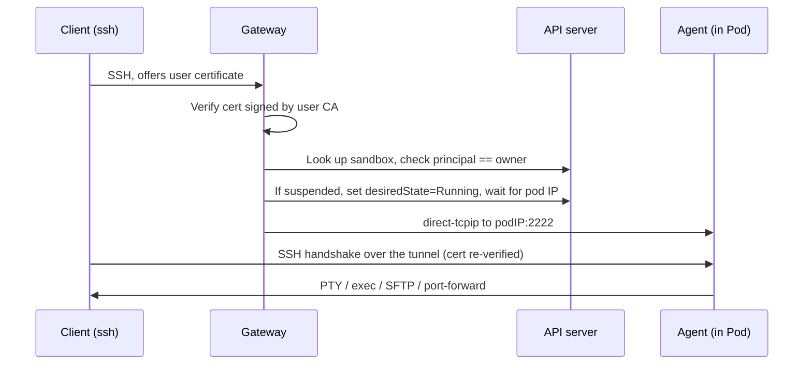

kubepark is deliberately small: **one operator, one gateway, four CRDs**. The
core provides exactly five things — lifecycle, isolation, connectivity,
permission injection, and audit — and nothing use-case-specific. Everything a
particular sandbox is *for* is expressed in a `SandboxTemplate` and an
`AccessProfile`, never in controller code.

## The central idea

A **Sandbox is a persistent, declarative resource; the Pod is a disposable
executor.** The substance of the environment is three things that outlive any
Pod:

- **State** — a per-sandbox home PVC whose lifecycle is independent of the
  Sandbox.
- **Permissions** — a ServiceAccount and RBAC synthesised from an
  `AccessProfile`.
- **Route** — a stable identity the gateway can reach.

A Pod dying (eviction, node drain, idle suspension) is not the Sandbox dying.

## Components

### Custom resources

| Kind | Scope | Role |
|------|-------|------|
| `Sandbox` | Namespaced | The only user-facing resource: desired state, idle timeout, exposed ports, owner. |
| `SandboxTemplate` | Cluster | Admin-defined class: image, resources, isolation level, allowed egress. |
| `AccessProfile` | Cluster | Declarative cluster permissions, translated into RBAC. |
| `SandboxSession` | Namespaced | Short-lived audit record of one connection. |

### Operator

The operator reconciles a Sandbox into a home PVC, a per-sandbox host key
(signed by an auto-bootstrapped host CA), a default-deny NetworkPolicy (with
built-in DNS and API-server egress), a ServiceAccount + RBAC from the
AccessProfile, and finally the executor Pod. The Pod runs non-root under
seccomp with the kubepark agent injected by an init container — template
images need no sshd.

### Gateway

A single SSH/HTTP entry point. It authenticates certificate-based SSH, routes
`<sandbox>.<namespace>` to the right Pod, and reverse-proxies HTTP exposed
ports by host name. It holds no state that cannot be reconstructed from the
API server.

## How an SSH connection reaches a sandbox

The same jump works for terminals, `scp`/`rsync`, VS Code Remote-SSH and
JetBrains Gateway — one `ProxyJump` line.

## What kubepark does not do

- It does not run workloads with GPUs; sandboxes are clients/entry-points to
  GPU and job infrastructure.
- It does not provision per-user namespaces; that is an admin/GitOps
  responsibility (see the security model).
- It does not guarantee that a running *process* survives Pod death — only
  that the environment and work state continue.
