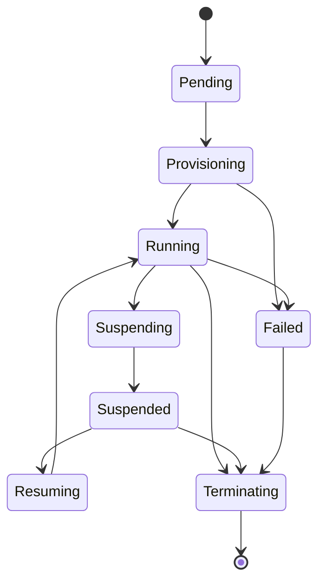

A `Sandbox` is a persistent, declarative resource; the Pod that runs it is a disposable executor. The controller reconciles the Sandbox toward its `desiredState`, and **conditions are the source of truth** — the `phase` you see in `status` is *derived* from them.

## Phases

The key conditions are `Ready`, `PodReady`, `HomeReady`, `RBACReady` and `TemplateOutdated`.

## Suspend triggers

A Running sandbox suspends when either:

- `desiredState: Stopped`, or
- it is **idle**: there are no `Active` sessions **and** `now - lastActivityTime > effective idleTimeout`.

The effective idle timeout comes from the Sandbox's `idleTimeout`, falling back to the template's `defaultIdleTimeout`; `0` disables idle suspension entirely.

On entering `Suspending`, `status.podIP` is **cleared first** so the gateway never dials a terminating pod. Then the Pod is deleted. Deliberately **kept**: the home PVC, the ServiceAccount, the Role/RoleBinding, and the host-key Secret.

## Resume triggers

A Suspended sandbox resumes when either:

- the gateway creates a new `Active` `SandboxSession` (and sets `desiredState` back to `Running`), or
- `desiredState` flips to `Running` directly.

## Idle bookkeeping

`lastActivityTime` is initialized the moment the sandbox **first reaches Running** — so a sandbox that is never connected to still eventually suspends. It is then advanced whenever a session closes. The controller **requeues at the idle deadline**, so suspension fires on time without external polling.

## Template drift

Template changes **never restart a Running pod**. The template hash is pinned onto the running Pod; if the template moves on, the drift is surfaced as a `TemplateOutdated` condition and applied on the **next suspend/resume cycle**. This keeps live work stable while still converging.

## Deletion and the finalizer

Deletion runs through the `kubepark.dev/finalizer` finalizer, which cleans up:

- the Pod,
- the ServiceAccount,
- Role/RoleBindings across **all** grant namespaces (found by label),
- the NetworkPolicy,
- the host-key Secret,

and marks any open `SandboxSession` records `Closed`.

The home PVC is handled per `home.retainPolicy`:

- **Retain** (default): the PVC is kept, its owner linkage is stripped, and it is labeled `kubepark.dev/orphaned-home=true`.
- **Delete**: the PVC is deleted — but **only** if kubepark created it. kubepark never deletes a PVC it did not create, which is why `existingClaim` together with `retainPolicy: Delete` is rejected by validation.

See [Storage](/kubepark/guides/storage/) for the PVC lifecycle in detail.
