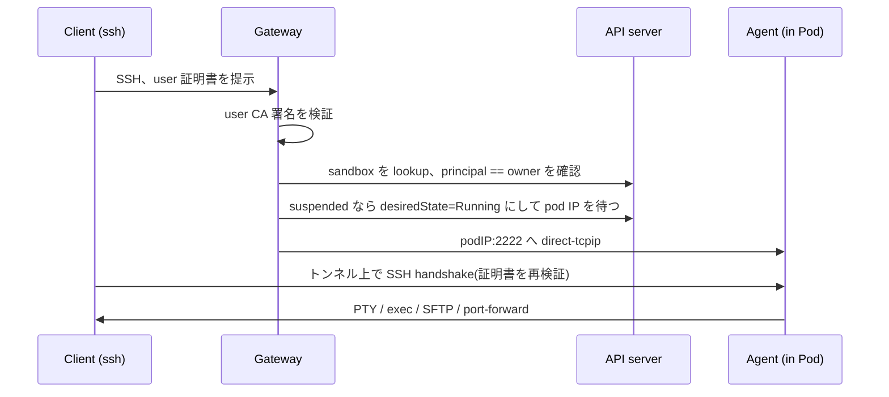

kubepark は意図的に小さく保たれている: **オペレーター1つ・ゲートウェイ1つ・
CRD 4つ**。コアが提供するのは5つ — ライフサイクル・分離・接続経路・権限注入・
監査 — だけで、用途固有のロジックは持たない。sandbox が「何のためのものか」は
すべて `SandboxTemplate` と `AccessProfile` の語彙で表現し、コントローラの
コードには持ち込まない。

## 中心となる考え方

**Sandbox は永続的な宣言的リソースであり、Pod は使い捨ての実行体。** 環境の
実体は、どの Pod よりも長生きする3つのもの:

- **状態** — Sandbox とは独立したライフサイクルを持つ、sandbox 毎のホーム PVC。
- **権限** — `AccessProfile` から生成される ServiceAccount と RBAC。
- **経路** — ゲートウェイが到達できる安定した identity。

Pod の死(eviction・node drain・アイドルサスペンド)は Sandbox の死ではない。

## 構成要素

### カスタムリソース

| Kind | スコープ | 役割 |
|------|---------|------|
| `Sandbox` | Namespaced | 唯一のユーザー向けリソース。desiredState・idleTimeout・公開ポート・owner。 |
| `SandboxTemplate` | Cluster | 管理者が定義するクラス。イメージ・リソース・分離レベル・許可 egress。 |
| `AccessProfile` | Cluster | 宣言的なクラスタ権限。RBAC に翻訳される。 |
| `SandboxSession` | Namespaced | 1接続ごとの短命な監査レコード。 |

### オペレーター

オペレーターは Sandbox を、ホーム PVC・sandbox 毎の host key(自動ブートストラップ
される host CA で署名)・default-deny の NetworkPolicy(DNS と API サーバーへの
組み込み egress 付き)・AccessProfile からの ServiceAccount + RBAC、そして最後に
実行体 Pod へと reconcile する。Pod は非 root・seccomp で動き、kubepark agent が
init container で注入されるため、テンプレートのイメージに sshd は不要。

### ゲートウェイ

単一の SSH/HTTP 入口。証明書ベースの SSH を認証し、`<sandbox>.<namespace>` を
該当 Pod へルーティングし、HTTP 公開ポートをホスト名でリバースプロキシする。
API サーバーから再構成できない状態は保持しない。

## SSH 接続が sandbox に届くまで

同じ jump で、ターミナル・`scp`/`rsync`・VS Code Remote-SSH・JetBrains Gateway
が動く — `ProxyJump` 1行で。

## kubepark がやらないこと

- GPU を持つワークロードは動かさない。sandbox は GPU/ジョブ基盤への
  クライアント・入口。
- ユーザー毎の namespace はプロビジョニングしない(管理者/GitOps の責務。
  セキュリティモデル参照)。
- 実行中の *プロセス* が Pod の死を越えて生存することは保証しない — 保証するのは
  環境と作業状態の継続性。
