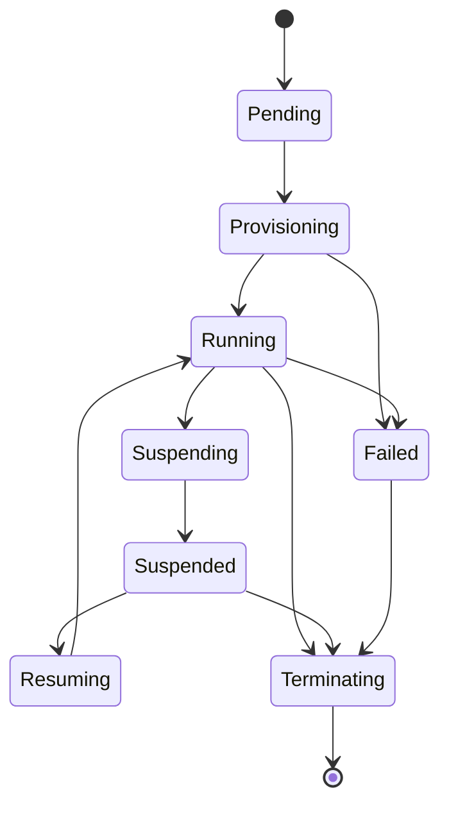

`Sandbox` は永続的な宣言的リソースであり、それを実行する Pod は使い捨ての実行体です。コントローラは Sandbox を `desiredState` へ収束させ、**condition が真実の源**です — `status` に見える `phase` はそこから*導出*されます。

## フェーズ

主要な condition は `Ready`・`PodReady`・`HomeReady`・`RBACReady`・`TemplateOutdated` です。

## サスペンドのトリガー

Running の sandbox は次のいずれかでサスペンドします。

- `desiredState: Stopped`、または
- **アイドル**である場合: `Active` セッションが無く、**かつ** `now - lastActivityTime > 有効な idleTimeout`。

有効なアイドルタイムアウトは Sandbox の `idleTimeout`、無ければテンプレートの `defaultIdleTimeout` にフォールバックします。`0` はアイドルサスペンドを完全に無効化します。

`Suspending` に入ると、まず `status.podIP` が**クリアされ**、ゲートウェイが終了中の Pod にダイヤルしないようにします。その後 Pod が削除されます。意図的に**残される**もの: home PVC、ServiceAccount、Role/RoleBinding、ホスト鍵 Secret。

## レジュームのトリガー

Suspended の sandbox は次のいずれかでレジュームします。

- ゲートウェイが新しい `Active` な `SandboxSession` を作成する(そして `desiredState` を `Running` に戻す)、または
- `desiredState` が直接 `Running` に反転する。

## アイドルの記帳

`lastActivityTime` は sandbox が**初めて Running に到達した**瞬間に初期化されます — そのため一度も接続されない sandbox でも最終的にサスペンドします。以後、セッションがクローズするたびに前進します。コントローラは**アイドル期限で requeue** するため、外部のポーリング無しでサスペンドが時間どおり発火します。

## テンプレートのドリフト

テンプレート変更が **Running の Pod を再起動することはありません**。テンプレートハッシュが実行中の Pod にピン留めされ、テンプレートが変わるとそのドリフトは `TemplateOutdated` condition として表面化し、**次のサスペンド/レジュームのサイクル**で適用されます。これにより稼働中の作業を安定させつつ収束します。

## 削除と finalizer

削除は `kubepark.dev/finalizer` finalizer を通じて行われ、以下をクリーンアップします。

- Pod、
- ServiceAccount、
- **すべての** grant namespace にまたがる Role/RoleBinding(ラベルで発見)、
- NetworkPolicy、
- ホスト鍵 Secret、

そして open な `SandboxSession` レコードを `Closed` にします。

home PVC は `home.retainPolicy` に従って扱われます。

- **Retain**(デフォルト): PVC は残され、owner との紐付けが剥がされ、`kubepark.dev/orphaned-home=true` のラベルが付きます。
- **Delete**: PVC は削除されます — ただし kubepark が作成した場合**のみ**です。kubepark は自身が作成していない PVC を決して削除しません。だからこそ `existingClaim` と `retainPolicy: Delete` の併用はバリデーションで拒否されます。

PVC のライフサイクルの詳細は[ストレージ](/kubepark/ja/guides/storage/)を参照してください。
